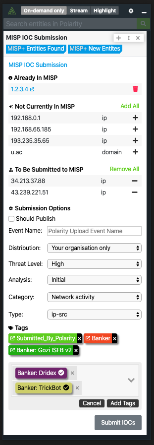

# Polarity MISP Integration

The Polarity MISP integration allows Polarity to search your instance of MISP to return found domains, IPs, hashes, and emails.  The integration also allows you to Create and Delete attributes (IOCs) in bulk from MISP.

> ***NOTE***: Attribute creation will create a new event containing all Attributes submitted.

<div>
  
</div>

## MISP Integration Options

### MISP URL

URL of your MISP instance to include the schema (i.e., https://) and port if applicable

```
https://my-misp-server.internal
```

### Authentication Key

'You MISP authentication key. If you have access to an authentication key, you can find it under "Event Actions" -> "Automation" in the MISP web interface.',

### Allow IOC Deletion

If checked, users will be able to delete an Attribute from MISP. (this setting must be set to `User can view only`).

> ***NOTE***: When you delete an Attribute you are doing a soft delete of the Attribute from the entire system, but will not delete Events containing those attributes.

## Installation Instructions

Installation instructions for integrations are provided on the [PolarityIO GitHub Page](https://polarityio.github.io/).

## Polarity

Polarity is a memory-augmentation platform that improves and accelerates analyst decision making.  For more information about the Polarity platform please see:

https://polarity.io/
